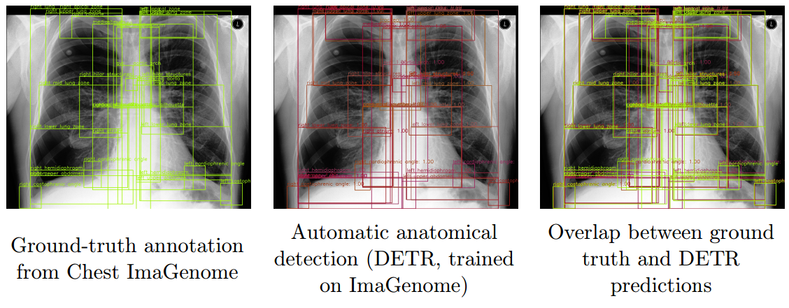

# 🫁 Automatic Anatomical Detection in Chest X-rays (CXR)

This repository contains code and resources for automatic detection and localization of anatomical regions in Chest X-rays.  
It is part of a broader research effort on multimodal explainability and report validation for medical imaging.



---

## 🚀 Overview
The goal of this project is to automatically identify and segment anatomical structures such as:
- Lungs (left / right)
- Heart
- Clavicles
- Diaphragm
- Mediastinum
- Other thoracic landmarks

The model aims to provide reliable region detection for downstream tasks such as:
- Visual grounding
- Text-guided report analysis
- Cross-modal consistency checks

---

## 🧩 Features
- DICOM and JPG compatibility  
- Configurable dataset loader (MIMIC-CXR, CheXpert, NIH)  
- Support for bounding-box and segmentation-based detection  
- Evaluation metrics (IoU, Dice, localization accuracy)  
- Visualization utilities for qualitative analysis  

---

## 🧠 Model
This repo contains a legacy and fine-tuned implementation of the following model:
- [DETR-based](https://github.com/facebookresearch/detr.git) object detection
---
## 📥 Model Checkpoint
Please download the pretrained checkpoint from this [link](https://drive.google.com/file/d/1MQFN8cqNiSd09y1wug0H_OAPUrnNuvgu/view?usp=drive_link)

and place it in the ```output/``` directory before running the code.

## 🧪 Usage

```bash
# Clone repository
git clone https://github.com/sayeh1994/CXR-Automatic-Anatomical-Detection.git
cd CXR-Automatic-Anatomical-Detection

# Install dependencies
pip install -r requirements.txt

# Run inference on sample image
python test.py --img_org="Path/to/image"
```

## 📊 Evaluation

Performance is measured using:

- Intersection over Union (IoU)

- Dice Coefficient

- Anatomical landmark localization accuracy

## 🧠 Training

To train the model, you will need access to the [Chest ImaGenome dataset](https://physionet.org/content/chest-imagenome/1.0.0/).  
Once the dataset is downloaded and properly organized, you can start training by running:

```bash
python main.py
```

## 🧾 Citation

If you use this work, please cite:
```bash
@article{GHOLIPOURPICHA2025100684,
title = {VICCA: Visual interpretation and comprehension of chest X-ray anomalies in generated report without human feedback},
journal = {Machine Learning with Applications},
volume = {21},
pages = {100684},
year = {2025},
issn = {2666-8270},
doi = {https://doi.org/10.1016/j.mlwa.2025.100684},
url = {https://www.sciencedirect.com/science/article/pii/S2666827025000672},
author = {Sayeh {Gholipour Picha} and Dawood {Al Chanti} and Alice Caplier},
keywords = {Chest X-ray, Phrase grounding, Image generation, Interpretability},
abstract = {As artificial intelligence (AI) becomes increasingly central to healthcare, the demand for explainable and trustworthy models is paramount. Current report generation systems for chest X-rays (CXR) often lack mechanisms for validating outputs without expert oversight, raising concerns about reliability and interpretability. To address these challenges, we propose a novel multimodal framework designed to enhance the semantic alignment between text and image context and the localization accuracy of pathologies within images and reports for AI-generated medical reports. Our framework integrates two key modules: a Phrase Grounding Model, which identifies and localizes pathologies in CXR images based on textual prompts, and a Text-to-Image Diffusion Module, which generates synthetic CXR images from prompts while preserving anatomical fidelity. By comparing features between the original and generated images, we introduce a dual-scoring system: one score quantifies localization accuracy, while the other evaluates semantic consistency between text and image features. Our approach significantly outperforms existing methods in pathology localization, achieving an 8% improvement in Intersection over Union score. It also surpasses state-of-the-art methods in CXR text-to-image generation, with a 1% gain in similarity metrics. Additionally, the integration of phrase grounding with diffusion models, coupled with the dual-scoring evaluation system, provides a robust mechanism for validating report quality, paving the way for more reliable and transparent AI in medical imaging.}
}
```
